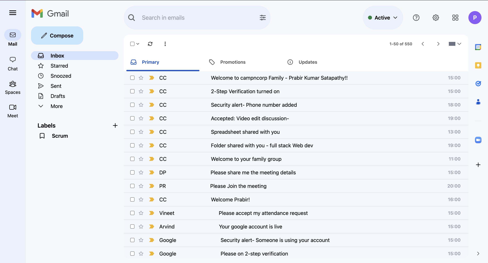

# Gmail UI Clone

This project is a simple clone of the Gmail user interface. It aims to replicate the look and feel of Gmail using modern web development technologies, specifically HTML and Tailwind CSS. This project is intended for educational purposes, to demonstrate the use of Tailwind CSS for designing responsive and modern web UIs.

## Output:

